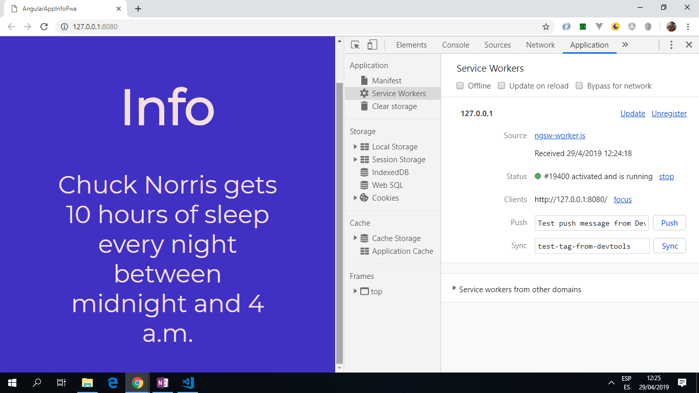

# :zap: Angular App Info PWA

* App to display information from an API with a fully working service worker.
* A service-worker is used to make this a Progressive Web Application (PWA).
* Tutorial code from [Gary Simon at DesignCourse](https://www.youtube.com/channel/UCVyRiMvfUNMA1UPlDPzG5Ow) see [:clap: Inspiration](#clap-inspiration) below.

*** Note: to open web links in a new window use: _ctrl+click on link_**

## :page_facing_up: Table of contents

* [:zap: Angular App Info PWA](#zap-angular-app-info-pwa)
  * [:page_facing_up: Table of contents](#page_facing_up-table-of-contents)
  * [:books: General info](#books-general-info)
  * [:camera: Screenshots](#camera-screenshots)
  * [:signal_strength: Technologies](#signal_strength-technologies)
  * [:floppy_disk: Setup](#floppy_disk-setup)
  * [:computer: Code Examples](#computer-code-examples)
  * [:cool: PWA/Angular Features](#cool-pwaangular-features)
  * [:clipboard: Status & To-Do List](#clipboard-status--to-do-list)
  * [:clap: Inspiration](#clap-inspiration)
  * [:envelope: Contact](#envelope-contact)

## :books: General info

* Angular httpClient used to get API data. rxjs observables are not used this time; just a simple http fetch of data.
* Progressive Web App: runs in the browser and manages data caching so API info is still displayed in the event of a loss of network. All PWAs require HTTPS (hypertext transport secure). They require a TLS (SSL - Secure Sockets Layer) or Digital certificate.

## :camera: Screenshots

.

## :signal_strength: Technologies

* [Angular v11](https://angular.io/)
* [Angular CLI v11](https://cli.angular.io/)
* [RxJS Library v6](https://angular.io/guide/rx-library) used to [subscribe](http://reactivex.io/documentation/operators/subscribe.html) to the API data [observable](http://reactivex.io/documentation/observable.html).
* [Angular service worker v11](https://angular.io/guide/service-worker-intro)

## :floppy_disk: Setup

**To see changes to app code:**

* Run `npm i` to install dependencies
* Run `ng lint` to lint files. All files pass linting.
* Run `ng serve` for a dev server. Navigate to `http://localhost:4200/`. The app will automatically reload if you change any of the source files.

**Once code changes complete:**

1. Run `ng build --prod` to create the build file.
2. Navigate to `\angular-app-infoPwa\dist\angular-app-infoPwa\`.
3. Type `http-server -o` and navigate to `http://192.168.0.104:8080` to see API working with the service worker in operation.
4. You should see something like:

  `_Starting up http-server, serving ./
  Available on:
  http://192.168.0.104:8080
  http://127.0.0.1:8080
  Hit CTRL-C to stop the server_`

## :computer: Code Examples

* `data.service.ts` using httpClient service with a `getInfo()` function to get user details from the API.

```typescript

import { Injectable } from '@angular/core';
import { HttpClient } from '@angular/common/http';

@Injectable({
  providedIn: 'root'
})
export class DataService {

  constructor(private http: HttpClient) { }

  getInfo() {
    return this.http.get('https://api.chucknorris.io/jokes/random');
  }
}

```

## :cool: PWA/Angular Features

* Manifest.json file
* [ngsw-config.json](https://angular.io/guide/service-worker-config) file: specifies which files and data URLs the service worker should cache and how it should update the cached files and data. Also has a url for fonts to use when offline. Other settings, including dataGroups "freshness" strategy option.
* [SwUpdate](https://angular.io/api/service-worker/SwUpdate) module used to subscribe to update notifications from the Service Worker, trigger update checks, and forcibly activate updates.

## :clipboard: Status & To-Do List

* Status: Working but service-worker not retested.
* To-Do: Check service-worker working. Update CSS to present info better or use Anular Mat cards. Change to reference a new API with more useful data and display more fields.

## :clap: Inspiration

* [Coursetro tutorial: Build your First Angular PWA from Scratch (Angular 6 PWA Tutorial)](https://www.youtube.com/watch?v=othhfZ0mGjU)
* [Angular Documentation: service worker introduction](https://angular.io/guide/service-worker-intro)

## :envelope: Contact

* Repo created by [ABateman](https://www.andrewbateman.org) - you are welcome to [send me a message](https://andrewbateman.org/contact)
